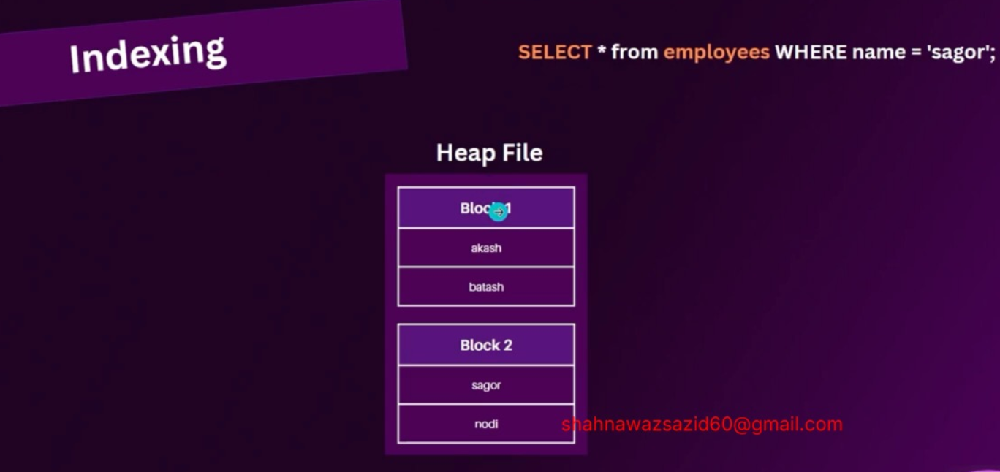

# Advanced-Query-Techniques-And-Objects-In-PostgreSQL

GitHub Link: https://github.com/Apollo-Level2-Web-Dev/dbms-postgres

## 10-1 Query Practice: Part 3

```sql
CREATE TABLE orders(
    order_id SERIAL PRIMARY KEY,
    customer_id INT,
    order_date DATE,
    total_amount DECIMAL(10,2)
)

INSERT INTO orders (customer_id, order_date, total_amount) VALUES
(101, '2025-05-01', 199.99),
(102, '2025-05-02', 89.50),
(103, '2025-05-03', 145.00),
(104, '2025-05-04', 320.75),
(101, '2025-05-05', 25.99),
(105, '2025-05-06', 470.00),
(102, '2025-05-07', 129.49),
(106, '2025-05-08', 250.00),
(107, '2025-05-09', 78.90),
(108, '2025-05-10', 199.00),
(102, '2024-03-07', 129.49),
(106, '2024-02-08', 250.00),
(107, '2024-01-09', 78.90),
(108, '2024-06-10', 199.00);


TRUNCATE TABLE orders
-- Find customers who have placed more than 2 orders and calculate the total amount spent by each of these customers.

SELECT customer_id, SUM(total_amount) as total_order_amount FROM orders
GROUP BY customer_id
HAVING count(order_id) >1;

-- Find the total amount of orders placed each month in the year 2022.

SELECT extract(month FROM order_date) as order_months, count(order_date) FROM orders
WHERE EXTRACT(YEAR FROM order_date) = 2024
GROUP BY order_months;

```

## 10-2 Exploring Subqueries

- `SUBQUERIES` : A subquery is a nested query within another sql statement
- and under which the subquery is written is called `Primary Query/ Main Query`

#### Why/when do we need subqueries

- Retrieve all employees whose salary is greater than the highest of the hr department.
- here two things are required :
  1. first find the hr department highest salary
  2. compare the Hr department highest salary with all employee salary

```sql
-- SELECT department_name, max(salary) from employees
-- GROUP BY department_name
-- HAVING department_name = 'HR';

SELECT  max(salary) from employees where department_name = 'HR'


SELECT * FROM employees WHERE salary > 63000;
```

- This is not right. we haver to use subqueries. since we will not know to what we have to compare.

```sql
SELECT * FROM employees WHERE salary > (SELECT  max(salary) from employees where department_name = 'HR')
```

- Here `SELECT * FROM employees WHERE salary > (SELECT  max(salary) from employees where department_name = 'HR')` takes a lot of data and returns one data. This is called `SCALER SUB QUERIES`.
- we have to take care where we use and how we use.

#### Sub queries can return some values

1. Can return single value (row-1,column-1)
2. Can return multiple rows
3. Can Return a single column

#### where we will use sub queries

| Clause   | Can Use Subquery? | Example                                                                                                               | Notes                                                          |
| -------- | ----------------- | --------------------------------------------------------------------------------------------------------------------- | -------------------------------------------------------------- |
| `SELECT` | ✅ Yes            | `SELECT (SELECT MAX(salary) FROM employees) AS max_salary`                                                            | Subquery returns a single value used in the SELECT output      |
| `FROM`   | ✅ Yes            | `SELECT * FROM (SELECT * FROM orders WHERE amount > 100) AS big_orders`                                               | Subquery returns a derived table (must be aliased)             |
| `WHERE`  | ✅ Yes            | `SELECT name FROM employees WHERE dept_id IN (SELECT id FROM departments)`                                            | Most common use case for filtering data based on another query |
| `JOIN`   | ✅ Yes            | `SELECT e.name, d.name FROM employees e JOIN (SELECT * FROM departments WHERE location = 'NY') d ON e.dept_id = d.id` | Less common but useful when joining with filtered sub-tables   |

- When we will use `subqueries` in `SELECT` we have to take care of that it should must return a single value.

## 10-3 Utilizing Subqueries in Different Clauses

### Using `Subqueries` with `SELECT`

- When we will use `subqueries` in `SELECT` we have to take care of that it should must return a single value.
- suppose we want to see the employees table and we want to see the sum of the employee salaries beside each of the employee

```sql
SELECT *, (SELECT sum(salary) FROM employees) FROM employees;
```

- Here `(SELECT sum(salary) FROM employees)` sub query returns a singe value
- `(SELECT salary FROM employees)` If we write this we will get a error since its not returning single value.

### Using `Subqueries` with `FROM`

- Suppose we have to show department name and beside the name we have to show the sum of the salary of each department's employees.

```sql
SELECT department_name, sum(salary) FROM employees
GROUP BY department_name;
```

- lets do it using sub queries

```sql
SELECT * FROM(SELECT department_name, sum(salary) FROM employees GROUP BY department_name) as sum_dept_salary;

SELECT department_name FROM(SELECT department_name, sum(salary) FROM employees GROUP BY department_name) as sum_dept_salary;
```

- here `(SELECT department_name, sum(salary) FROM employees GROUP BY department_name)` is returning a table so that we can see all the data.
- we can take care of what we are doing inside the sub query.we have to take care of the things like sub queries result should be compatible with the main query.

### Using `Subqueries` with `WHERE`

- Here the sub queries should return a single data or table or multiple data that depends on the thing we want to compare.

- this where condition is working based on singe value

```SQL
SELECT * FROM employees WHERE salary > (SELECT  max(salary) from employees where department_name = 'HR')
```

- lets consider a scenario like by using a subquery we will get the `R` Named Departments among the employees and then we will show their data
- now lets see sub queries with multiple values. using `IN` Means it can return multiple row.
- basically it depends on the comparison operator.

```sql
SELECT employee_name, salary, department_name FROM employees
WHERE department_name IN (SELECT department_name from employees where department_name LIKE '%R%')
```

- But in here if it return multiple column it will not work. since inside `IN` we have to send a single column data.

```sql
SELECT employee_name, salary, department_name FROM employees
WHERE department_name,salary IN (SELECT department_name from employees where department_name LIKE '%R%')
```


## 10-4 Exploring Views in PostgreSQL

- its like js function which allows us not to write repetitive code. we call function name and do our works.
- `View` Is Same Kind Of Thing. we can write a complex query and store in variable like thing and use it later by calling by name.
- `View` are virtual tables generated from the result of a sql query.
- Basically it stores the reference of the sql query.
- When we do the view a virtual table is created.
- As we use the table we can use the view as the same way.

#### Why It name is view?

- Its something like from the window we see some view of the world.
- Same as using view we see the required data from the world of database.
- By viewing the required data we store the viewed data in `View` so this is the reason it is called view.

#### What is the purpose of the view

1. `Simplifying complex queries.` The purpose we can think of it like for complexing query we are storing in variable like place and then using it everywhere we need.

```sql
CREATE VIEW dept_avg_salary -- view name
AS --as clause
SELECT department_name, avg(salary) FROM employees GROUP BY department_name; --query whose reference will be stored in view.
```

- We do not have to `SELECT department_name, avg(salary) FROM employees GROUP BY department_name;` create this again and again we will call `dept_avg_salary` whenever is needed. view is not storing any value its just keeping the reference and when the view is called the view is doing the work and giving the result.
- For Complex Queries we can make the views.

```sql
SELECT * FROM dept_avg_salary;
```

- Another example

```sql
CREATE VIEW test_view AS
SELECT employee_name, salary, department_name
FROM employees
WHERE department_name IN (
    SELECT department_name
    FROM employees
    WHERE department_name LIKE '%R%'
);

SELECT * FROM test_view;
```

1. `Improving Security` : Suppose we have a situation like we have to give a random user a certain access by using which he can see certain result and we want make sure that he is not getting any internal data. we do not want to let any info like table name table column to outer world.

- this is bad practice we just have to give access of the data not any other information. for this we can create a view and give so that what is going on under the hood.

2. `Enhanced data abstraction`

### There are two types of view

1. `Materialized view` : Here query result inside the view is physically stored and when called the result is given instant. Performance is increased here.
2. non materialized view (we have seen so far).

## 10-5 Exploring Functions in PostgreSQL

Now Lets talk about function or procedures in postgres.

- We know sql works in `declarative` way. as we say to do it, we do not say how to do it.
- In `Imperative` We say that do it and we also say how to do it.

#### These things are can be said `procedural`(Imperative) or `Non-Procedural`(declarative).

- SQL follows `non-procedural` manner by default.
- But sometimes we need to use `Procedural` Approach when we write complex logic using complex structures like `loops` `conditionals`, `exception handling` etc. These are available in sql but its in limited. if we want to use these in broader way in postgres we will use some extensions like popular one `PL/pgSQL`, `PL/Perl`, `PL/python` etc.

### Procedural Approach:

1. Language Support: Supports procedural languages like PL/pgSQL, PL/Perl, PL/Python, etc
2. Complex Logic: Allows for complex logic using control structures like loops, conditionals, and exception handling.
3. Variable Support: Supports variable declarations and manipulation within the procedural code.
4. Stored Procedures/Functions: Provides the ability to create stored procedures or functions,

### Non-Procedural Approach:

1. Declarative Queries: Focuses on writing declarative SQL queries to retrieve, insert, update, or delete data from the database.
2. Simplicity: Emphasizes simplicity by expressing operations in terms of what data is needed.
3. SQL Functions: Supports SQL functions, which are single SQL statements that return a value or set of values.
4. Performance: Can sometimes offer better performance for simple operations due to the optimized query execution plans generated by the database engine.

### Lets see how we can create function in SQL?

- Lets Prepare a function that will do the counting of the employees and show us the function.
- We are creating function for silly task. Basically we will create a function for the tasks where we have to do repetitive task as like other programming language.

#### `NON-Procedural` Function

```sql
SELECT * from employees;

SELECT count(*) FROM employees

CREATE Function emp_count()
RETURNS INT
LANGUAGE sql -- here can be plpgsql/plperl/PL/Python or etc for PROCEDURAL
AS
$$
-- here will be the function body
SELECT count(*) FROM employees
$$

SELECT emp_count();
```

- suppose our function will be like when called something will be `Updated` or `Deleted`

```sql
CREATE or REPLACE function delete_emp()
RETURNS void
LANGUAGE SQL
AS
$$
DELETE FROM employees WHERE employee_id = 30;
$$

SELECT delete_emp();

```

- here its just deleting the data and returning void
- here `CREATE or REPLACE` is used to maintain the function name.

##### how we can use parameter inside a function?

```sql
CREATE OR replace FUNCTION delete_emp_by_id(p_emp_id INT)
RETURNS void
LANGUAGE SQL
AS
$$
DELETE FROM employees WHERE employee_id = p_emp_id;
$$

SELECT delete_emp_by_id(29);
```

## 10-6 Exploring Stored Procedure in PostgreSQL

- Before postgres version 11 we were not able to write procedures in postgres. we were just able to write functions inside postgres.

#### The main difference between function and Procedures are

- Procedure can do a work but can not return anything.
- Function can return if we want.
- Before version 11 of postgres we were used to write a function and tell that Return is void. this was called procedures
- But now in updated version we can write procedures.

#### `Procedural` Function

- suppose we have to remove a employee. and now do it using procedure.
- using the plpgsql we can open new transaction.
- Allows for complex logic using control structures like loops, conditionals, and exception handling.

```sql
CREATE PROCEDURE remove_emp()
LANGUAGE plpgsql
AS
$$
BEGIN
-- here we can write multiple sql queries or one single queries
-- here will exist the works/action that we want to do using procedure.
DELETE FROM employees WHERE employee_id = 28;
END
$$

CALL remove_emp()
```

- Inside the procedure we can take parameter and use variables as well.
- lets assume that if we have any id value 28 then we will proceed.

```sql
CREATE PROCEDURE remove_emp_var()
LANGUAGE plpgsql
AS
$$
DECLARE
test_var INT;
BEGIN
SELECT employee_id INTO test_var FROM employees WHERE employee_id = 26;
DELETE FROM employees WHERE employee_id = test_var;
END
$$

CALL remove_emp_var()

SELECT * FROM employees
```

- If we want we can pass parameters inside procedures.

```sql
CREATE PROCEDURE remove_emp_by_p(p_employee_id int)
LANGUAGE plpgsql
AS
$$

DECLARE
test_var INT;
-- variable declared.

BEGIN
SELECT employee_id INTO test_var FROM employees WHERE employee_id = p_employee_id;
 -- we are setting the id to the variable test_var and then we are doing the operation
DELETE FROM employees WHERE employee_id = test_var;

RAISE NOTICE 'Employee Removed Successfully';
-- this will give a notice if deleted.
END

$$;

CALL remove_emp_by_p(27)

SELECT * FROM employees
```

- The use cases are like suppose we have a lot of large table. suppose a order is created now we want to update in total sale and who has ordered we want to give him points. we will write all the works in procedures step by step it will work and the data integrity will be maintained.
- If we want we can use if else condition inside procedure.

## 10-7 Practical Implementation of Triggers in PostgreSQL

- A trigger is a database object in PostgreSQL (and other database management systems) that automatically executes a specified set of actions in response to certain database events or conditions.
- Its kind of react on Click Event since on click event fires when the event is clicked.
- We can create trigger here which is like event and which will run after happening a event or before happening the event.
- Trigger might have some steps which will also run automatically.

### What Could be the event types ?

1. `Table-Level Events:`
   - INSERT, UPDATE, DELETE, TRUNCATE
2. `Database-Level Events:`
   - Database Startup, Database Shutdown, Connection start and end etc

### When Trigger is Used?

- Suppose we have a user table and now we want to delete a user and then we want to store the deleted users information in another table. we will use trigger here to do it automatically.

#### Now Lets Create a `Trigger`

```sql
-- CREATE TRIGGER trigger_name
-- {BEFORE | AFTER | INSTEAD OF} {INSERT | UPDATE | DELETE | TRUNCATE}
-- ON table_name
-- [FOR EACH ROW]
-- EXECUTE FUNCTION function_name();
-- CREATE trigger TR
-- BEFORE delete
-- on user
-- for EACH row
-- EXECUTE function_name();
```

```sql
CREATE Table my_users
(
    user_name VARCHAR(50),
    email VARCHAR(100)
);

INSERT INTO my_users VALUES('Mezba', 'mezba@mail.com'), ('Mir', 'mir@mail.com');

SELECT * from my_users;

SELECT * from deleted_users_audit;

CREATE  Table deleted_users_audit
(
    deleted_user_name VARCHAR(50),
    deletedAt TIMESTAMP
)


DROP TABLE deleted_users_audit

DROP TABLE my_users

-- lets create a trigger

CREATE OR replace function save_deleted_user()
RETURNS TRIGGER
LANGUAGE plpgsql
AS
$$
BEGIN

INSERT INTO deleted_users_audit values(OLD.user_name, now());
-- we are using OLD here since we are getting after delete here and the data became old.
-- here OLD.user_name means what will delete whose row's user name will get here using this.
-- If it was a before functionality we will get the data in new.user_name
-- we are getting new and old since `each row`  is mentioned. If its mentioned that `EACH STATEMENT` we wont get the new or old
RAISE NOTICE'Deleted User Log Created!';
RETURN OLD;

END
$$

CREATE OR replace Trigger save_deleted_user_trigger
BEFORE DELETE
on my_users -- The table from the user will be deleted
FOR EACH ROW --So if you run a DELETE statement that deletes 5 rows, your trigger function (save_deleted_user()) will be called 5 times, once per row.
--we are getting new and old since `each row`  is mentioned. If its mentioned that `EACH STATEMENT` we wont get the new or old
EXECUTE function save_deleted_user();
-- if we use mysql we can  create a function statement directly but in postgres we can not, in postgres we have to give  a function reference her which makes it more readable.

DELETE from my_users WHERE user_name = 'Mir';
```

| Trigger Type         | Fires Per Row | Access to OLD/NEW | Use Case                                         |
| -------------------- | ------------- | ----------------- | ------------------------------------------------ |
| `FOR EACH ROW`       | ✅ Yes        | ✅ Yes            | Audit/log individual rows, enforce rules         |
| `FOR EACH STATEMENT` | ❌ No         | ❌ No             | General logging, enforcing statement-level logic |

- we can do it rather doing it using sql, we can do it programmatically using drivers using prisma.
- In Prisma We Will use js to tell the logics. this makes simpler
- we will do it in backend but in terminal using raw postgres or sql it becomes complex.

## 10-8 Indexing Techniques in PostgreSQL

- A database indexing is a strategically designed data structure that enhances the speed of data retrieval activities in database table

```sql

CREATE TABLE employees (
    employee_no SERIAL PRIMARY KEY,
    birth_date DATE NOT NULL,
    first_name VARCHAR(14) NOT NULL,
    last_name VARCHAR(16) NOT NULL,
    gender CHAR(1) CHECK (gender IN ('M', 'F')),
    hire_date DATE NOT NULL
);

INSERT INTO employees (birth_date, first_name, last_name, gender, hire_date)
VALUES
-- Original entries
('1993-01-02', 'Sarah', 'Chang', 'F', '2016-01-27'),
('1991-12-10', 'Deanna', 'Dixon', 'F', '2020-07-17'),
('1979-04-02', 'Walter', 'Howard', 'M', '2023-12-21'),
('1970-11-03', 'Brenda', 'Taylor', 'F', '2019-08-24'),
('2005-05-06', 'Victoria', 'Patel', 'F', '2017-11-19'),
('1985-07-14', 'James', 'Smith', 'M', '2015-03-01'),
('1990-09-21', 'Emily', 'Johnson', 'F', '2018-06-12'),
('1982-02-10', 'Robert', 'Williams', 'M', '2014-11-30'),
('1995-03-25', 'Linda', 'Brown', 'F', '2021-02-18'),
('1988-06-17', 'Michael', 'Jones', 'M', '2017-09-07'),
('1996-12-05', 'Jennifer', 'Garcia', 'F', '2022-10-25'),
('1975-08-29', 'William', 'Miller', 'M', '2013-05-14'),
('1983-11-19', 'Elizabeth', 'Davis', 'F', '2016-08-30'),
('1992-04-04', 'David', 'Rodriguez', 'M', '2019-01-10'),
('1987-01-08', 'Susan', 'Martinez', 'F', '2020-04-04'),
('1999-10-12', 'Daniel', 'Hernandez', 'M', '2021-12-15'),
('2001-06-30', 'Jessica', 'Lopez', 'F', '2023-03-22'),
('1973-09-16', 'Charles', 'Gonzalez', 'M', '2012-10-01'),
('1989-05-20', 'Karen', 'Wilson', 'F', '2015-07-09'),
('1994-02-28', 'Matthew', 'Anderson', 'M', '2018-01-27'),
('2000-11-11', 'Ashley', 'Thomas', 'F', '2022-06-04'),
('1997-03-07', 'Joseph', 'Moore', 'M', '2020-08-19'),
('1981-12-24', 'Amanda', 'Taylor', 'F', '2017-11-11'),
('1978-04-15', 'Andrew', 'Jackson', 'M', '2013-02-23');


TRUNCATE Table employees

SELECT * FROM employees;

EXPLAIN ANALYSE -- this will how the query is executed and show how much time is taken.
SELECT * from employees WHERE last_name = 'Moore';
```

- Before Indexing result
  

```sql
EXPLAIN ANALYSE -- this will how the query is executed and show how much time is taken.
SELECT * from employees WHERE last_name = 'Moore';

CREATE INDEX idx_employees_last_name
ON employees (last_name);
```

- After indexing result


### Now lets see how he reduces the execution time

- First lets see how postgres stores the data

```sql
SHOW data_directory
```


- Shows the location where the data is saved.


- here data is stored inside the files using binary format

## 10-9 Understanding How Indexing Works in PostgreSQL.

- stored data inside the files using binary format is called heap file



- The data can not be stored in single block inside heap file. It is spitted into different blocks.
- when we do any query database engine can not directly take the file from the hard drive and can not perform any action.


- Rather database engine tries to take the data from the hard drive to the memory.
- The Transfer of data from hard disk to memory is costly. This consumes time. Our target is to reduce.
- When we do not do any indexing each and every block come from hard disk heap file to memory one by one.


- so while doing query over non-indexed table it will scan the full table to do indexing. We have to optimize this.
- While using the `Where` type clause we have to take care that we are not doing full table scan.
- Here comes the help of `Indexing`


- When indexing is done index named file/table/object is created where her holds the information that which name is in which block's which index.
- If we want to do the query to find name `sagor`, it will see that in index object that sagor is in block 2.


- So It will go to the heap file 2nd block and transfer only the second block in the memory.


- this is how we are getting data faster since full table is not coming.

### Now Come to the part that when we will do the indexing?

- We have to take care while creating indexing, since indexing info is kept in database and taking some space.
- Suppose we have a field that gets updated frequently, in this case doing indexing is tricky, whenever the data gets updated the indexing will get the change as well. whe have to avoid the fields that updates frequently. when the indexing is done in such field if data is updated/deleted we have to bring changes to indexing as well and which is costing time.
- We will do indexing the fields those are coming frequently in `WHERE` ,`JOIN` ,
- Whe have to use indexing in `FOREIGN KEY`
- Inside `PRIMARY KEY`, `UNIQUE KEY` postgres implicitly applies indexing automatically

```sql
SELECT * from employees WHERE employee_no = 1;
```

### Indexing has some algorithms

-

1. `B-TREE` : when we do indexing it create b-tree indexing by default
2. HASH
   ```SQL
   CREATE INDEX idx_employees_last_name
   ON employees USING HASH (last_name);
   ```
3. GIN
4. GIST

- In different use case different algorithm works fine.
- Basically we use B-TREE

# SQL Practice Tasks - Module 10

This repository contains practice SQL tasks for mastering advanced SQL topics including **subqueries**, **views**, **functions**, **stored procedures**, **triggers**, and **indexing** in **PostgreSQL**.

---

## 📘 Demo Table Overview

The following tasks are based on these sample tables. Use them as references while solving the exercises.

### 🔹 `students` Table

| Column Name   | Description                               |
| ------------- | ----------------------------------------- |
| id            | Auto-incremented primary key              |
| name          | Name of the student                       |
| age           | Age of the student                        |
| score         | Numeric score of the student              |
| department_id | Foreign key referencing departments table |

### 🔹 `departments` Table

| Column Name | Description                             |
| ----------- | --------------------------------------- |
| id          | Auto-incremented primary key            |
| name        | Name of the department (e.g., CSE, EEE) |

### 🔹 `course_enrollments` Table

| Column Name  | Description                            |
| ------------ | -------------------------------------- |
| id           | Auto-incremented primary key           |
| student_id   | Foreign key referencing students table |
| course_title | Name of the enrolled course            |
| enrolled_on  | Date of enrollment (`DATE`)            |

---

```sql
CREATE TABLE departments (
    id SERIAL PRIMARY KEY,
    name VARCHAR(50) NOT NULL
);

CREATE TABLE students (
    id SERIAL PRIMARY KEY,
    name VARCHAR(50) NOT NULL,
    age INTEGER NOT NULL,
    score NUMERIC(10,4) ,
    department_id INTEGER NOT NULL REFERENCES departments(id)
);


CREATE TABLE course_enrollment (
    id SERIAL PRIMARY KEY,
    student_id INTEGER NOT NULL REFERENCES students(id),
    course_title VARCHAR(100) NOT NULL,
    enroll_on DATE NOT NULL
);

INSERT INTO departments (name)
VALUES
    ('CSE'),
    ('EEE'),
    ('BBA'),
    ('ME'),
    ('Civil');


INSERT INTO students (name, age, score, department_id)
VALUES
('Alice', 20, 91.5, 1),
    ('Bob', 21, 78.0, 2),
    ('Charlie', 22, 84.3, 1),
    ('David', 20, 65.7, 3),
    ('Eve', 23, 88.9, 2),
    ('Frank', 24, 92.4, 4),
    ('Grace', 21, NULL, 5),
    ('Rachel', 22, 85.2, 1),
    ('Steve', 24, 60.0, 3),
    ('Trudy', 20, NULL, 2),         -- score is NULL
    ('Uma', 21, 92.7, 1),
    ('Victor', 23, 48.5, 4),
    ('Wendy', 25, 75.3, 5),
    ('Xander', 26, 88.8, 3),
    ('Yasmine', 22, 79.5, 2),
    ('Zane', 24, NULL, 4),          -- score is NULL
    ('Abigail', 20, 66.6, 5),
    ('Heidi', 22, 79.2, 1),
    ('Ivan', 20, 55.0, 3),
    ('Judy', 25, 89.5, 2),
    ('Kevin', 23, 95.0, 1),
    ('Laura', 24, 70.0, 4),
    ('Mallory', 21, 67.8, 5),
    ('Nathan', 22, 82.6, 2),
    ('Olivia', 20, NULL, 3),  -- Another NULL score
    ('Peter', 26, 74.1, 4),
    ('Quinn', 23, 90.3, 1);

INSERT INTO course_enrollment (student_id, course_title, enroll_on)
VALUES
(1, 'Database Systems', '2024-01-15'),
    (1, 'Operating Systems', '2024-02-10'),
    (2, 'Circuit Analysis', '2024-03-12'),
    (3, 'Algorithms', '2024-04-01'),
    (4, 'Marketing Basics', '2024-02-20'),
    (6, 'Thermodynamics', '2024-05-01'),
    (7, 'Cybersecurity Fundamentals', '2023-11-15'),
    (8, 'Data Analytics', '2024-01-20'),
    (9, 'Digital Marketing', '2023-12-05'),
    (10, 'Machine Learning', '2024-03-10'),
    (11, 'Thermal Engineering', '2024-04-18'),
    (12, 'Fluid Mechanics', '2023-10-08'),
    (13, 'Econometrics', '2024-05-21'),
    (14, 'Intro to AI', '2024-02-28'),
    (15, 'Project Management', '2024-03-02'),
    (16, 'Database Systems', '2024-04-25'),
    (17, 'Software Engineering', CURRENT_DATE);

drop Table course_enrollment;
drop Table students;
drop Table departments;
```

## 🔍 Query Practice & Subqueries (10-1 to 10-3)

- **Retrieve all students who scored higher than the average score.**

```sql
SELECT* from students
WHERE score > (SELECT avg(score) from students);
```

- **Find students whose age is greater than the average age of all students.**

```sql
SELECT * FROM students
WHERE age > (SELECT avg(age) from students);
```

- **Get names of students who are enrolled in any course** (use `IN` with subquery).

```sql
SELECT * from students;
SELECT * from students
WHERE id IN (SELECT student_id FROM course_enrollment);
```

- **Retrieve departments with at least one student scoring above 90** (use `EXISTS`).

```sql
SELECT * FROM departments
WHERE EXISTS (
    SELECT 1
    FROM students
    WHERE students.department_id = departments.id
    AND students.score > 90
);

SELECT* from students;
SELECT* from departments;
SELECT* from course_enrollment
```

---

## 👁️ Views in PostgreSQL (10-4)

- **Create a view to show each student’s name, department, and score.**

```sql
CREATE OR REPLACE VIEW joining_view AS
SELECT
    students.id AS student_id,
    students.name AS student_name,
    departments.name AS department_name,
    students.score
FROM students
JOIN departments ON students.department_id = departments.id;


SELECT * FROM joining_view;


CREATE OR REPLACE VIEW student_view
AS
SELECT
    student_name,
    department_name,
    score
FROM joining_view;

SELECT * FROM student_view;
```

- **Create a view that lists all students enrolled in any course with the enrollment date.**

```sql
CREATE or replace view enrollment_joining
AS
SELECT
course_enrollment.id AS course_id,
students.name AS student_name,
course_enrollment.course_title,
course_enrollment.enroll_on
FROM course_enrollment
JOIN students ON  course_enrollment.student_id = students.id;


SELECT* FROM course_enrollment;
SELECT* FROM students

SELECT* FROM enrollment_joining
```

---

## 🧩 Functions in PostgreSQL (10-5)

- **Create a function that takes a student's score and returns a grade**  
  _(e.g., A for 90+, B for 80–89, C for 70–79, F otherwise)_.

```sql
CREATE  or replace FUNCTION grab_grade(score numeric)
RETURNS TEXT
LANGUAGE plpgsql
as
$$

BEGIN
    IF score >= 90 THEN
        RETURN 'A';
    ELSIF score >= 80 THEN
        RETURN 'B';
    ELSIF score >= 70 THEN
        RETURN 'C';
    ELSE
        RETURN 'F';
    END IF;
END

$$

SELECT name, score, grab_grade(score) FROM students;

select * from students

select * from departments

```

- **Create a function that returns the full name and department of a student by ID.**

```sql
SELECT students.name as student_name, departments.name as department_name
FROM students
JOIN departments ON departments.id = students.department_id;

CREATE or replace FUNCTION dpt_fn()
RETURNS  TABLE(student_name TEXT, department_name TEXT)
LANGUAGE sql
AS
$$
SELECT students.name as student_name, departments.name as department_name FROM students
JOIN departments ON departments.id = students.department_id;
$$

SELECT * FROM dpt_fn();
```

---

## ⚙️ Stored Procedures (10-6)

- **Write a stored procedure to update a student's department.**

```sql

CREATE OR REPLACE PROCEDURE update_student_department(
    p_student_id INT,
    p_new_department_id INT
)
LANGUAGE plpgsql
AS $$
BEGIN
    UPDATE students
    SET department_id = p_new_department_id
    WHERE id = p_student_id;

    RAISE NOTICE 'Student ID % department updated to %', p_student_id, p_new_department_id;
END;
$$;

CALL update_student_department(1, 2);

```

- **Write a procedure to delete students who haven't enrolled in any course.**

```sql
CREATE OR REPLACE PROCEDURE delete_unenrolled_students()
LANGUAGE plpgsql
AS $$
BEGIN
    DELETE FROM students
    WHERE id NOT IN (
        SELECT DISTINCT student_id FROM course_enrollments
    );

    RAISE NOTICE 'All unenrolled students have been deleted.';
END;
$$;

CALL delete_unenrolled_students();

```

---

## 🔁 Triggers in PostgreSQL (10-7)

- **Create a trigger that automatically logs enrollment when a student is added to `course_enrollments`.**

- **Add a trigger that sets the score to `0` if a new student record is added without a score.**

---

## 🚀 Indexing (10-8 & 10-9)

- **Add an index to the `score` column in the `students` table.**

- **Add a composite index on `student_id` and `enrolled_on` in the `course_enrollments` table.**

- **Compare query performance with and without indexes using `EXPLAIN`.**

---
